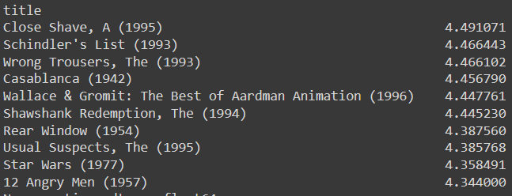
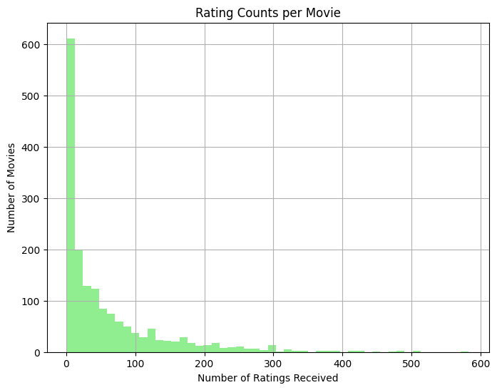
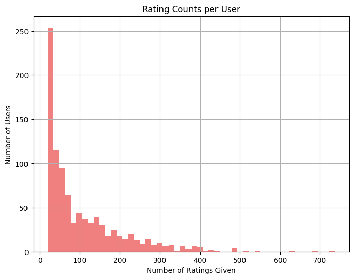
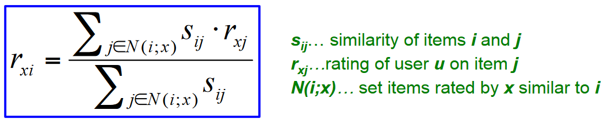
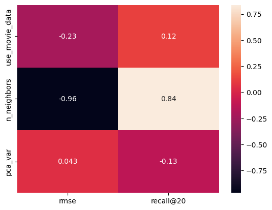

# Introduction

Recommender systems have become extremely popular in recent years as a way to personalize content and product
recommendations for users in many domains. Many major companies like Amazon, Netflix, and Spotify now use recommender
systems to tailor their offerings to each customer's individual tastes. The aim of these systems is to analyze data
about users and items to identify patterns that can be used to predict the items a user may be interested in.

Collaborative filtering is a common technique used in many recommender systems. It works by analyzing relationships
between users and items based on their ratings, likes, purchases, etc in order to find connections. For example, if User
A and User B both gave 5 star ratings to the same several movies, then the system can infer that User A may like other
films that User B rated highly. It does not rely on descriptive attributes of items or users.

In this project, we develop a movie recommender system using collaborative filtering applied to the MovieLens 100K
dataset. This dataset contains 100,000 movie ratings from 943 users on 1,682 movies. It also includes demographic
information about each of the users including age, gender, occupation, and zip code. Our goal is to leverage this
dataset to build a system that can provide personalized movie recommendations for users based on a combination of their
demographic data and movie ratings history.

# Data analysis

**Detailed description of data files from assigment statement:**

| **File** | **Description** |
| -------- | --------------- |
| u.data | Full dataset of 100000 ratings by 943 users on 1682 items. Users and items are numbered consecutively from 1. The data is randomly ordered. This is a tab separated list of user id, item id, rating, and timestamp. The time stamps are unix seconds. |
| u.info | The number of users, items, and ratings in the u data set |
| u.item | Information about the items (movies). This is a tab separated list of movie id, movie title, release date, video release date, IMDB URL, and genres. The last 19 fields are genres and contain binary values. Movies can be of several genres at once. The movie ids are the ones used in u.data |
| u.genre | List of genres. |
| u.user | Demographic information about the users. This is a tab separated list of user id, age, gender, occupation, zip code. The user ids are the ones used in in u.data file. |
| u.occupation | List of occupations. |
| u1.base, u1.test, u2.base, u2.test, u3.base, u3.test, u4.base, u3.test, u5.base, u5.test | The data sets u1.base and u1.test through u5.base and u5.test are 80%/20% splits of the u data into training and test data. Each of u1, ..., u5 have disjoint test sets; this if for 5 fold cross validation (where you repeat your experiment with each training and test set and average the results). These data sets can be generated from u.data by mku.sh. |
| ua.base, ua.test, ub.base, ub.test | The data sets ua.base, ua.test, ub.base, and ub.test split the u data into a training set and a test set with exactly 10 ratings per user in the test set. The sets ua.test and ub.test are disjoint. These data sets can be generated from u.data by mku.sh. |
| allbut.pl | The script that generates training and test sets where all but n of a users ratings are in the training data |
| mku.sh | A shell script to generate all the u data sets from u.data. |

During EDA, I got myself familiar with data structure and made some plots:

Top 10 movies with >50 ratings according to our data:

# Model Implementation

For the model implementation I took inspiration from the following sources:
- [Lecture Slides](https://moodle.innopolis.university/mod/resource/view.php?id=102906)
- [Kaggle Notebook on MovieLens](https://www.kaggle.com/code/abhikjha/movielens-fastai-collab#Collaborative-Filtering-using-SVD)
- [Analysis of MovieLens dataset](http://www.gregreda.com/2013/10/26/using-pandas-on-the-movielens-dataset/)

I used simple item-item Collaborative Filtering approach with cosine similarity nearest neighbors.

Model implementation details can be found in the [recsys.py](../models/recsys.py).
My RecSys has the following structure:
- Initialization: in this step we create a class instance and pass the number of neighbors in KNN and PCA variance;
- Fitting is done on a set of data that has (user_id, movie_id, rating) structure. Additionally, we can pass movies 
  additional features to improve similarity metric. Here we create user-item rating matrix, and create sklearn 
  pipeline consisting of Scaler and PCA. After dimensionality reduction, we build nearest neighbors search space, 
  and retrieve distances and neighbors;
- Then there are some functions for creating recommendations for unseen movies. The estimated rating is obtained 
  with the following formula: 

# Model Advantages and Disadvantages

Advantages:
- Works better than user-user approach;
- No special feature selection needed: can be applied to any kind of items;
- Easy-to-implement: does not require sophisticated training procedure.

Disadvantages:
- Cold start: needs enough users for better performance;
- Sparsity: the user-item matrix is sparse and big even after dimensionality reduction;
- Cannot recommend items that were not ratedl
- Tends to recommend popular items, not the best performance.

# Training Process

Collaborative filtering does not require complicated training. The whole process is pretty much memorising the data 
as we use PCA and nearest neighbors.

PCA reduces dimensionality by ~33% leaving 99% of variability of data (and by ~50% with 90% of variability). And NN 
allows faster search of similar items 

"Training" steps:
- Initialize class with desired PCA variance and nearest neighbors.
- Fit the training data: construct user-item matrix, add movie metadata, reduce dimensionality, apply nearest neighbors.
- ???
- Ready for inference!

## Parameter search

As my system does not require excessive training, it was dependent on hyperparameters. Therefore, I performed a 
series of simple grid searches, which I can summarize by the following correlation heatmap:

As one can observe, it is clear that increasing number of neighbors allows to both reduce RMSE and improve Recall@20.
Also, introducing movie metadata allowed for better performance. However, too high or too low PCA variance was bad, 
so I stick to leaving 90% of variance when using MinMaxScaler.

# Evaluation

First, I fine-tuned hyperparameters using ua.base and ua.test data validating parameters on ua.test. Then, for the 
final benchmark, I applied model to the ub.base data and benchmarked its performance on ub.test.

For each user I computed four metrics:
- RMSE: rooted mean squared error of predicted ratings vs the true ones
- MAE: mean absolute error of predicted ratings vs the true ones
- Recall@K: the portion of relevant (true rating > 3.5) movies in retrieved in K recommended
- Precision@K: the portion of top K recommended movies that were in relevant (true rating > 3.5)

@K metrics were evaluated for K = 10,20,50

# Results

After benchmarking the model on ub.test data, I obtained the following metrics:

|Metric|score|
|---|---|
|RMSE    |    0.999|
|MAE    |    0.796|
|Recall@10|        0.031|
|Recall@20|        0.061|
|Recall@50 |        **0.140**|
|Presicion@10|        0.019|
|Presicion@20|        0.017|
|Presicion@50|        0.016|